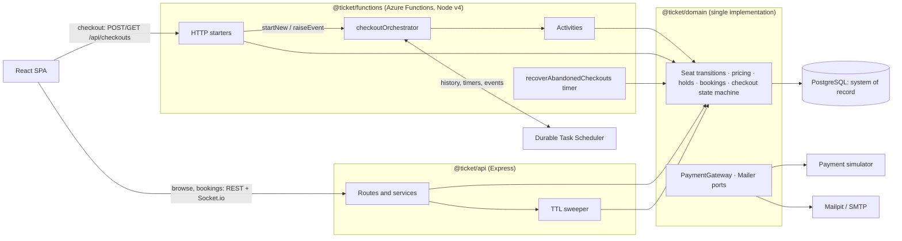
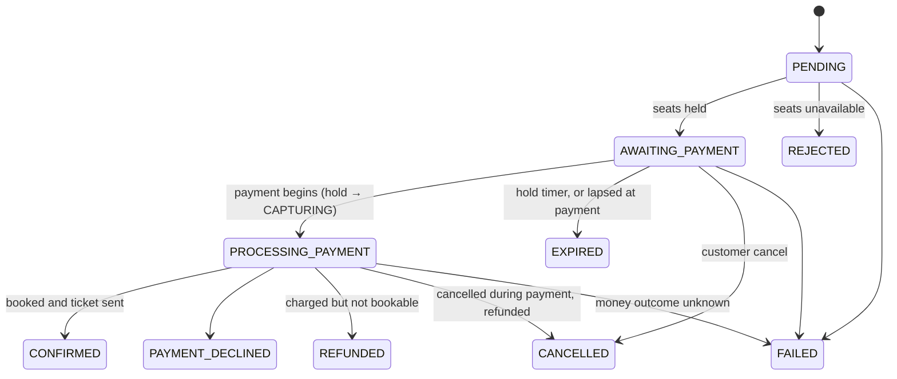

# DESIGN — Checkout on Azure Durable Functions

This document covers the checkout re-implementation: the critical path from seat
selection through hold, payment, booking confirmation and ticket delivery,
including hold expiry and customer cancellation. The pre-existing system is
described in [SYSTEM_DESIGN.md](SYSTEM_DESIGN.md); operating procedures are in
[RUNBOOK.md](RUNBOOK.md).

## Overview

- **One business implementation.** `@ticket/domain` owns the Prisma schema, the
  transaction runner, seat locks and transitions, pricing, holds, bookings, the
  checkout state machine, ticket delivery, and the payment and mail ports. The
  legacy API and the Functions app are thin adapters over it (R1).
- **PostgreSQL is the system of record (L2).** `GET /checkouts/{id}` reads the
  `Checkout` row, never orchestration state; DTS holds only the workflow position.
- **The orchestration drives; the database decides.** Every orchestration
  activity is an idempotent, row-locked domain operation that judges
  preconditions (hold still valid, booking already made, cancellation pending)
  inside its own transaction with the database clock.

Checkout state machine (enforced by a transition table in `checkout.ts`):

## Refactoring

### What moved where, and why

| From (legacy) | To | Why |
|---|---|---|
| `api/prisma/schema.prisma`, migrations | `domain/prisma` | Locks and conditional transitions are business rules; the schema belongs to the domain, not to one consumer. |
| `api/src/lib/prisma.ts` | `domain/src/db/client.ts` | One client per process, shared by every host. |
| `api/src/lib/jwt.ts`, `ids.ts` | `domain/src/auth/tokens.ts`, `domain/src/ids.ts` | Booking creation signs QR tokens; the Functions app validates the API's JWTs. The secret is read lazily to avoid racing `.env` loading. |
| Inline `prisma.$transaction` + unordered `FOR UPDATE` (6 places) | `runInTransaction` + `lockSeats` | Bounded lock and statement timeouts, bounded retry on deadlock or lock timeout, and one global lock order. |
| Pricing in 3 places, float maths, `Math.round(amount*100)` | `quoteSeats` (integer minor units) | One pricing rule; exact `Decimal` conversion (`0.29*100 ≠ 29` in floats). |
| Hold logic in `holds.service.ts` | `domain/src/holds` (`placeHoldTx`, `endHoldTx`, `releaseHold`, `releaseExpiredHolds`, `isHoldActive`) | Shared hold validity; transaction-scoped forms let the checkout compose them under its own lock. |
| Ad-hoc `showSeat.updateMany` calls | Guarded transitions `holdSeats` / `releaseHeldSeats` / `bookSeats` / `freeBookedSeats` | Each matches only its source state and verifies the row count, so a skipped check fails loudly instead of overwriting another checkout's seat. |
| Booking creation duplicated (hold confirmation, waitlist accept) | `createBooking`, `convertHoldToBooking`, `cancelBooking` | One booking rule (R1). |
| `api/src/lib/payments.ts` (untyped, random idempotency key) | `PaymentGateway` port + `SimulatorPaymentGateway` | Typed outcomes, unknown-outcome resolution, correlation header. |
| Mailer, QR, email templates, `sendTicketEmail` | `domain/src/tickets` (`Mailer` port, `createMailer`, `deliverTicket`) | Ticket delivery is on the critical path; delivery is recorded so retries do not resend. |
| Text logger | `domain/src/observability/logger.ts` | One structured JSON logger for every host (T3). |
| — | `domain/src/checkout` | The Checkout aggregate and state machine driven by the saga. |
| `payment-sim/Dockerfile` | Two added `COPY` lines for the `domain` and `functions` manifests | `npm ci` inside the image resolves every workspace's `package.json`. The simulator's code and behaviour are untouched. |

### Legacy checkout endpoints and jobs

| Legacy piece | Decision | Justification |
|---|---|---|
| `POST /api/shows/:id/holds` | **Kept**, adapter over `placeHold` | The existing tests and older clients use it; the rules are now shared. The SPA checks out through the Checkout API. |
| `DELETE /api/holds/:id` | **Kept**, adapter over `releaseHold`; **409 on checkout-owned holds** | Releasing a checkout's hold would free seats the orchestration still tracks. |
| `POST /api/bookings` | **Kept (deprecated path)**, adapter over the domain; **409 on checkout-owned holds** | The existing waitlist tests and older clients use it. Fixed: random idempotency key → deterministic per (hold, card); a replay returns the booking its payment bought instead of refunding a charge in use; decline is now 402 (was 500). New clients should use the Checkout API. |
| `POST /api/bookings/:id/cancel` | **Kept**, over `cancelBooking` | Booking cancellation is outside checkout; it shares the seat transition and feeds the waitlist. |
| `POST /api/waitlist/offers/:token/accept` | **Kept**, over `createBooking` | Removes the duplicated booking creation. |
| Sweeper: expired holds | **Kept, narrowed** to holds no checkout owns, selected by the database clock | A checkout hold's lifetime belongs to its durable timer. A competing sweeper would be a second owner of the same expiry. |
| Sweeper: expired waitlist offers | **Kept** | Outside checkout (orchestrating the waitlist is listed under More time). |
| Lazy expiry inside hold placement | **Kept**, in the domain, ACTIVE holds only | Correctness never depends on timer precision; it cannot touch a CAPTURING hold. |
| *(new)* `recoverAbandonedCheckouts` timer | **Added** to the Functions app | Backstop for lost orchestrations (the DTS emulator is in-memory); never touches PROCESSING_PAYMENT. |

### Changed and removed tests (R3)

No legacy assertion was changed or removed.

| Test file | Change | Justification |
|---|---|---|
| `api/tests/{concurrency,ttl,waitlist}.test.ts` | Import of the Prisma client from `@ticket/domain` | The client moved to the domain. |
| same | Fixtures imported from `@ticket/domain/testing` | `helpers.ts` moved to `domain/tests/fixtures.ts`, unchanged, so domain and API tests share it. |
| `api/tests/waitlist.test.ts` | The `../src/lib/mailer` mock also provides `mailer` | The module now exports the throwing `mailer` (ticket delivery) next to the best-effort `sendMail`. |
| *(new)* `api/tests/payments.test.ts`, `api/tests/checkout-guards.test.ts` | Added | Cover the legacy payment fixes and the checkout-owned-hold guards. |

## Orchestration design

- **One orchestration per checkout:** `checkoutOrchestrator`, instance id = `checkoutId` (a UUID generated by `POST /checkouts`). The `Checkout` row is written first (PENDING) and then `startNew` runs; if `startNew` fails, the checkout is failed with its seats released and the client gets 503. A deterministic id makes the instance, the row, the idempotency keys and the logs line up.
- **Input:** `{ checkoutId, correlationId }`. Everything else is read from PostgreSQL by activities, so the orchestration never carries stale business data.
- **Activities** (`functions/src/activities`): `holdCheckoutSeats`, `beginCheckoutPayment`, `chargeCheckout`, `confirmCheckoutBooking`, `refundCheckout`, `sendCheckoutTicket`, `completeCheckout`, `releaseCheckout`, `failCheckout`. Each is a thin adapter over an idempotent domain operation. They **return** business outcomes (declined, rejected, not bookable, cancel requested) and **throw** only for failures worth retrying. The JS SDK's retry options cannot filter by error type, so this split is what keeps retries meaningful.
- **Timer and events:** after the hold, `Task.any([createTimer(holdExpiresAt), waitForExternalEvent('PaymentSubmitted'), waitForExternalEvent('CancelRequested')])`. The losing timer is cancelled. Events raised before the orchestration waits are buffered. Only the first payment event is consumed; later duplicates are ignored.
- **Expiry authority:** the timer is the trigger, but `beginCheckoutPayment` re-judges expiry with PostgreSQL's `now()`. A payment that loses the race to expiry ends EXPIRED regardless of clock skew between hosts.
- **Payment:** `beginCheckoutPayment` flips the hold ACTIVE → CAPTURING, so no sweeper or lazy expiry can free seats while money is in flight. Then charge → `confirmCheckoutBooking` → `sendCheckoutTicket` → `completeCheckout`.
- **CONFIRMED is published after the ticket is sent.** If mail is still down after the activity's retries, CONFIRMED is published anyway (the booking stands) and delivery continues on durable timers: 3 rounds, 5 minutes apart.
- **Custom status:** `{ status, step, checkoutId, correlationId }` (e.g. `step: "charging"`), visible in the DTS dashboard.
- **Determinism:** no I/O, clock or randomness in the orchestrator; time comes from `context.df.currentUtcDateTime`; logs are emitted only when `!isReplaying`.
- **Lifecycle:** the orchestration completes when the checkout reaches a terminal status. Abandoned AWAITING_PAYMENT checkouts (orchestration lost) are expired by the recovery timer after `CHECKOUT_RECOVERY_GRACE_SECONDS`.
- **No checkout is left non-terminal behind a dead orchestration.** A top-level handler catches any activity that exhausts its retries without a branch of its own (hold, begin, release, complete) and records FAILED with the step it stopped at: seats released if no charge was attempted, kept otherwise. Only when FAILED itself cannot be written does the orchestration fail (RUNBOOK).
- **Events that cannot be delivered:** `POST /payment` on a checkout whose instance no longer exists closes it as FAILED with its seats released (nothing was charged) and answers 409; any other delivery error answers 503 so the client retries. `POST /cancel` whose event cannot be delivered cancels an AWAITING_PAYMENT checkout directly in PostgreSQL (`cancelUnpaidCheckout`); during payment the recorded request is enough.
- **Why not Durable Entities or critical sections:** the legacy API also writes seats (holds, waitlist), and it does not go through entities. The only lock that protects every writer is the PostgreSQL row lock in the system of record. An entity lock would add a second, partial source of mutual exclusion.

## Compensation matrix

| Step | Forward action | Compensation | Idempotency key source | Unknown outcome handling |
|---|---|---|---|---|
| Start | Insert `Checkout` PENDING, `startNew(instanceId = checkoutId)` | If `startNew` fails: FAILED, seats released (none held yet) | `checkoutId` (row PK, instance id) | Upsert by id; a duplicate start is a no-op |
| Hold seats | `holdCheckoutSeats`: seats → HELD, Hold ACTIVE, AWAITING_PAYMENT | `releaseCheckout` (EXPIRED / CANCELLED / PAYMENT_DECLINED / REFUNDED) frees the seats | Checkout status guard under the row lock (PENDING only) | Retried activity returns the current state; never a second hold |
| Begin payment | Hold ACTIVE → CAPTURING, PROCESSING_PAYMENT | `releaseCheckout` accepts ACTIVE or CAPTURING holds | Status guard (AWAITING_PAYMENT only) | Retried activity returns `processing` |
| Charge | `POST /v1/charges` with `metadata.checkoutId` and `X-Correlation-Id` | Refund (next row) | `{checkoutId}:charge` | No response → `GET /v1/charges?idempotencyKey=`. Still unknown after retries → FAILED, **seats kept** (a paid seat must not be resold) |
| Confirm booking | Hold → CONVERTED, Booking CONFIRMED, seats → BOOKED | Before commit: refund + release (REFUNDED, or CANCELLED if the customer cancelled). After commit: none, the booking stands | `Checkout.bookingId` (unique) and `Booking.paymentKey` = `{checkoutId}:charge` (unique) | Retries exhausted → FAILED, no refund, no release: an earlier attempt may have committed |
| Refund | `POST /v1/refunds` | — (it *is* the compensation) | `{checkoutId}:refund` | Same key replays; `409 charge_already_refunded` counts as done. Exhausted or rejected → FAILED "refund manually", seats kept |
| Send ticket | Email QR ticket, record `ticketEmailSentAt` | None needed (the booking stands) | `Booking.ticketEmailSentAt` | Crash between send and record can resend (at-least-once). Failure → CONFIRMED anyway, then 3 redelivery rounds |
| Complete | PROCESSING_PAYMENT → CONFIRMED | — | Status guard | Idempotent |
| Customer cancel | `cancelRequestedAt` recorded, then `CancelRequested` raised | Before payment: release CANCELLED. During payment: refund + CANCELLED | Row lock; recorded once | If the event arrives after the orchestration stopped waiting, `confirmCheckoutBooking` still sees the recorded request and refunds. If the event cannot be delivered at all, an AWAITING_PAYMENT checkout is cancelled directly under its row lock |

Guarantees: CONFIRMED ⇒ exactly one net succeeded charge equal to `amountDue` and a ticket delivered eventually within a bounded window (see Deviations). Every other terminal status except FAILED ⇒ zero net charge. FAILED keeps any money and seats untouched for an operator ([RUNBOOK.md](RUNBOOK.md)).

## Transaction inventory

All transactions go through `runInTransaction`: **READ COMMITTED**, `lock_timeout = 2s`, `statement_timeout = 5s` (`SET LOCAL` via `set_config`), Prisma `timeout = 10s` and `maxWait = 5s`. **Global lock order: Checkout → ShowSeat (by primary key) → Hold → Booking.** ShowSeat precedes Hold because placing a hold must lock seats before it can know which lapsed holds to expire.

| Transaction | Owning activity / caller | Rows locked, in order | On deadlock (40P01) / serialization (40001) / lock timeout (55P03) |
|---|---|---|---|
| `createCheckout` | `POST /checkouts` | None: a single-statement upsert by id, outside the runner | Not retried (a lone insert takes no contended lock); an error is an HTTP 500 and the client starts a new checkout |
| `holdCheckoutSeats` | `holdCheckoutSeats` | Checkout `FOR UPDATE` → ShowSeat (ordered) → lapsed Holds → new Hold | Runner retries ≤3; then the activity's Durable retry (4 attempts) |
| `beginCheckoutPayment` | `beginCheckoutPayment` | Checkout → hold's ShowSeats → Hold | Same |
| `confirmCheckoutBooking` | `confirmCheckoutBooking` | Checkout → ShowSeat → Hold → Booking insert (≤3 extra attempts on reference collision) | Same; exhausted → FAILED |
| `completeCheckout` | `completeCheckout` | Checkout | Same |
| `releaseCheckout` | `releaseCheckout`, recovery timer | Checkout → ShowSeat → Hold | Same |
| `failCheckout` | `failCheckout`, `POST /checkouts` on start failure | Checkout (→ ShowSeat → Hold when releasing) | Same |
| `requestCheckoutCancel` | `POST /checkouts/{id}/cancel` | Checkout | Runner retries; then HTTP 500 (client may retry) |
| `cancelUnpaidCheckout` | `POST /checkouts/{id}/cancel` when the event cannot be delivered | Checkout → ShowSeat → Hold | Same |
| `placeHold` | Legacy `POST /shows/:id/holds` | ShowSeat (ordered) → lapsed Holds → new Hold | Runner retries; then HTTP 500 |
| `releaseHold` | Legacy `DELETE /holds/:id`, sweeper | ShowSeat (ordered) → Hold | Runner retries; the sweeper retries next pass |
| `convertHoldToBooking` | Legacy `POST /bookings` | ShowSeat → Hold → Booking insert | Runner retries; then refund + HTTP error |
| `cancelBooking` | Legacy booking cancel | ShowSeat → Booking | Runner retries |
| Waitlist accept / offer / expire | Legacy waitlist | ShowSeat; WaitlistEntry `FOR UPDATE SKIP LOCKED` | Runner retries |
| `deliverTicket` | `sendCheckoutTicket`, legacy | No explicit lock; one `UPDATE Booking.ticketEmailSentAt` | Activity retry |

Business refusals (DomainError) and other errors are never retried by the runner. 40001 cannot normally arise at READ COMMITTED and is handled defensively. Known, accepted gap: when a hold placement expires a lapsed hold that owns *more* seats than requested, those extra seats are released outside the ordered lock set; the worst case is a deadlock that PostgreSQL detects and the runner retries.

## Retry policy table

| Activity / call | Retrying layer | Attempts | Backoff | Retryable | Not retryable (returned outcome) |
|---|---|---|---|---|---|
| Any domain transaction | `runInTransaction` | 3 | Full jitter, 50 ms × 2ⁿ | 40P01, 40001, 55P03 (Prisma P2034 / P2010) | DomainError, constraint violations, everything else |
| Booking reference collision | `inBookingTransaction` | 3 | None | P2002 on `reference` | Other unique violations |
| `holdCheckoutSeats`, `beginCheckoutPayment`, `confirmCheckoutBooking`, `completeCheckout`, `releaseCheckout`, `failCheckout` | Durable `database` policy | 4 | 1 s, ×2, max 10 s | Connection errors, exhausted runner retries | REJECTED / expired / not payable / not confirmable / cancel requested |
| `chargeCheckout` | Durable `payment` policy | 5 | 2 s, ×2, max 15 s | 503, 429, timeout, network (after lookup by key) | `declined` (402), `rejected` (400, 404, `idempotency_key_reuse`) |
| `refundCheckout` | Durable `payment` policy | 5 | 2 s, ×2, max 15 s | 503, 429, timeout, network | `rejected` (400, 404); 409 already refunded = success |
| `sendCheckoutTicket` | Durable `email` policy, then orchestrator | 4, then 3 rounds | 5 s, ×2, max 30 s; rounds 5 min apart | SMTP / provider errors | Already sent (skipped) |
| Payment HTTP call | None (one attempt per call) | 1 | — | Timeout `PAYMENT_TIMEOUT_MS` = 10 s | — |
| Legacy `POST /bookings` charge | None; the client may retry safely | 1 | — | 503 to client | 402 decline, 502 rejection |
| Recovery timer | Timer schedule | every minute | — | Next run | — |

Retry layers are not multiplied: the HTTP adapter makes one attempt, the activity policy is the only retry above it, and the transaction runner only covers contention inside a single attempt. The 10 s payment timeout deliberately exceeds the simulator's slowest processing (`tok_slow`, 5 s), because the simulator does not deduplicate *in-flight* requests that share a key.

## Failure modes

| Failure mode | Handling | Test |
|---|---|---|
| N customers race for one seat | Row locks; one AWAITING_PAYMENT, others REJECTED | `acceptance/…failures…` "holds a seat for exactly one of several concurrent checkouts"; `domain/checkout.test.ts` same; `api/concurrency.test.ts` |
| Overlapping multi-seat requests | Ordered locks, no deadlock | `domain/transaction.test.ts` "serialises overlapping multi-seat locks…" |
| Lock held too long | `lock_timeout`, bounded retry, gives up after 3 | `domain/transaction.test.ts` lock timeout tests |
| Payment submitted repeatedly or concurrently | First event consumed; fixed key | `acceptance/…failures…` "charges once however many times payment is submitted concurrently" |
| Provider 503s | Durable retry, same key | `acceptance/…failures…` "retries transient provider failures…" (`tok_flaky`); `domain/payments.test.ts` |
| Charge response never arrives | Lookup by key, then retry | `acceptance/…failures…` "resolves a charge whose response never arrives…" (`tok_timeout`); `domain/payments.test.ts` |
| Card declined | PAYMENT_DECLINED, single request, seat released | `acceptance/checkout.acceptance.test.ts` "does not retry a declined charge…"; unit "releases PAYMENT_DECLINED after a single charge call" |
| Hold expires unpaid | Timer → EXPIRED, seat released, no charge | `acceptance/checkout.acceptance.test.ts` "expires an unpaid checkout…" |
| Payment arrives after expiry | DB clock at begin → EXPIRED, no charge | `domain/checkout.test.ts` "expires a checkout whose hold lapsed before payment began…"; unit "does not charge when the hold lapsed…" |
| Cancel before payment | CANCELLED, seat released | `acceptance/checkout.acceptance.test.ts` "cancels while awaiting payment…" |
| Cancel during payment | Refund, CANCELLED, zero net | `acceptance/…failures…` "refunds when the customer cancels while the charge is in flight"; `domain/checkout.test.ts` |
| Charged but seats not bookable | Refund, REFUNDED | unit "refunds its own charge and ends REFUNDED…" |
| Refund fails | FAILED, money and seats kept | unit "keeps money and seats for an operator when the refund cannot be made" |
| Unknown charge outcome after retries | FAILED, seats kept | unit "fails to an operator and keeps the seats…" |
| Unknown booking outcome after retries | FAILED, no refund or release | unit "neither refunds nor releases when the booking outcome is unknown" |
| Provider rejects the request | FAILED, seats released | unit "fails and releases the seats when the provider rejects…"; `domain/checkout.test.ts` "can release the seats" |
| Mail outage | CONFIRMED, bounded redelivery | unit "confirms despite a mail outage…"; `domain/tickets.test.ts` |
| Activity retried after commit | Idempotent domain operations | `domain/checkout.test.ts` "every step idempotent"; `domain/holds.test.ts`; `domain/bookings.test.ts` |
| Functions host crashes mid-charge | DTS redelivers; same key | `npm run test:restart` (`scripts/restart-drill.ts`) |
| Orchestration lost (emulator restart) | Recovery timer expires AWAITING_PAYMENT after grace | `domain/checkout.test.ts` "expireAbandonedCheckouts…" |
| Payment submitted to a lost orchestration | 409, FAILED, seats released, no charge | `acceptance/…failures…` "refuses payment with 409, charges nothing and closes the checkout as FAILED" |
| Cancel on a lost orchestration | Cancelled directly, AWAITING_PAYMENT only | `acceptance/…failures…` "still cancels a checkout awaiting payment"; `domain/checkout.test.ts` "cancelling without the orchestration" |
| A database step exhausts its retries (hold, release, complete) | FAILED with the step; seats released only if no charge was attempted | unit "a step exhausts its retries" (4 tests) |
| Sweeper or lazy expiry vs payment in flight | CAPTURING is immune | `domain/checkout.test.ts` "never frees a CAPTURING hold…", "the sweeper skips them" |
| Payment simulator reset (charge ids restart) | Uniqueness on our key, not the provider id | `domain/bookings.test.ts` "are unique by our payment key…" |
| Legacy endpoints on a checkout hold | 409 | `api/checkout-guards.test.ts` |
| Legacy booking retried or concurrent | Deterministic key, replay returns the booking | `api/payments.test.ts` |

## Observability

- **One correlation id per checkout** (`correlationId`, a UUID), generated by `POST /checkouts`, stored on the row, returned by `GET /checkouts/{id}`, carried in the orchestration input and in every activity input, bound into every related log line (HTTP, orchestrator outside replay, activities), and sent as `X-Correlation-Id` on every simulator call (T2).
- **Structured JSON logs** (T3): one object per line with `time`, `level`, a stable `event` name (`checkout.accepted`, `checkout.seats.held`, `checkout.payment.charged`, `checkout.compensation.refunded`, `checkout.failed`, …), `service`, `checkoutId`, `correlationId`, `activity` and `invocationId`. Errors are serialised with their `cause`.
- **Tracing one checkout end to end:** `GET /checkouts/{id}` → `correlationId`; filter the logs with `jq 'select(.correlationId == "…")'`; open the instance (`checkoutId`) in the DTS dashboard (http://localhost:8082) for history, custom status and the current step; match provider calls with `GET :4100/__admin/requests` filtered by `correlationId`.
- **Finding stuck instances:** non-terminal checkouts whose `updatedAt` is old (indexed by `[status, updatedAt]`), FAILED checkouts with their `failureReason`, and DTS instances whose custom status `step` has not moved. See [RUNBOOK.md](RUNBOOK.md).

## More time

- **Bonus items:** orchestrate the waitlist offer flow (its sweeper is the last legacy timer); deploy to Azure (Flex Consumption + a DTS resource + PostgreSQL Flexible Server, Bicep, managed identity for DTS); OpenTelemetry / Application Insights with W3C `traceparent` (the simulator already records it).
- An operator endpoint or CLI to reconcile FAILED checkouts against the provider ledger by idempotency key.
- Exactly-once ticket email via an outbox plus a deterministic `Message-ID`, instead of at-least-once.
- Alerting on FAILED counts and on checkouts stuck past a threshold; a metrics dashboard.
- A separate test database (tests currently share the dev database), CI running every test level, and dependency upgrades (`npm audit`).
- Replace the `tok_*` payment token in the orchestration history with a vaulted reference.
- Push realtime seat updates from checkout transitions to other open seat maps (the Functions app has no Socket.io; other viewers see the change on their next seat-map load).

## Deviations

- **Legacy checkout endpoints are kept, not delegated.** `POST /shows/:id/holds` and `POST /bookings` remain as adapters over the shared domain, guarded against checkout-owned holds, because the existing tests and older clients depend on them. The SPA and new clients use the Checkout API.
- **Cancel after the booking is committed returns 409.** The contract reserves 409 for terminal checkouts; a checkout whose booking already exists is treated as effectively terminal, so "CANCELLED ⇒ zero net charge" holds without cancelling bookings.
- **Ticket email is at-least-once**, not exactly-once (crash window between send and record).
- **"Eventually delivered" is bounded.** Delivery is tried 4 times, then in 3 more rounds 5 minutes apart. After that the checkout stays CONFIRMED, `checkout.ticket.undelivered` is logged, and the customer still has the QR in *My Bookings*; an operator resends it (RUNBOOK).
- **No Durable Entities or critical sections:** PostgreSQL row locks are the single mutual-exclusion mechanism (see Orchestration design).
- **Expiry is judged by the database clock;** the durable timer can fire up to the host–database clock skew early or late.
- **Payment tokens appear in the orchestration history** (event payload); acceptable for the simulator's test tokens, not for real card data.
